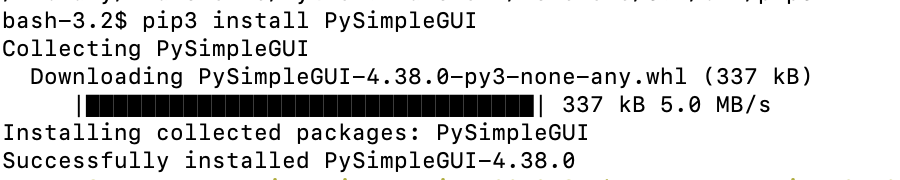
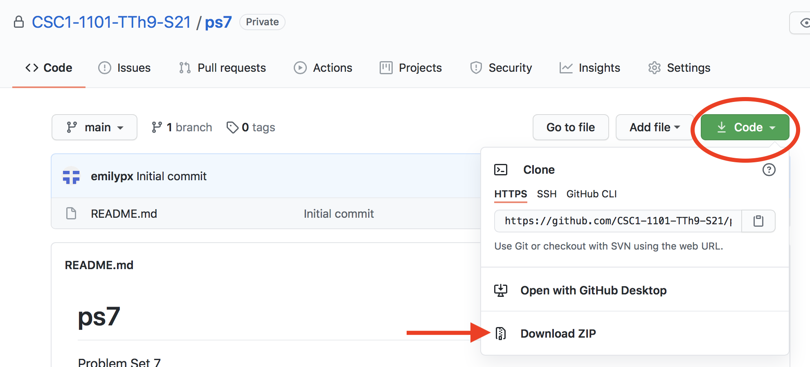
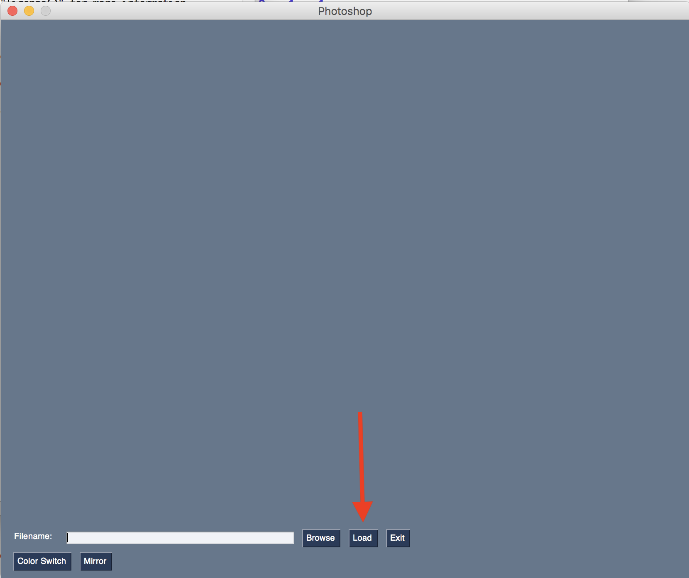
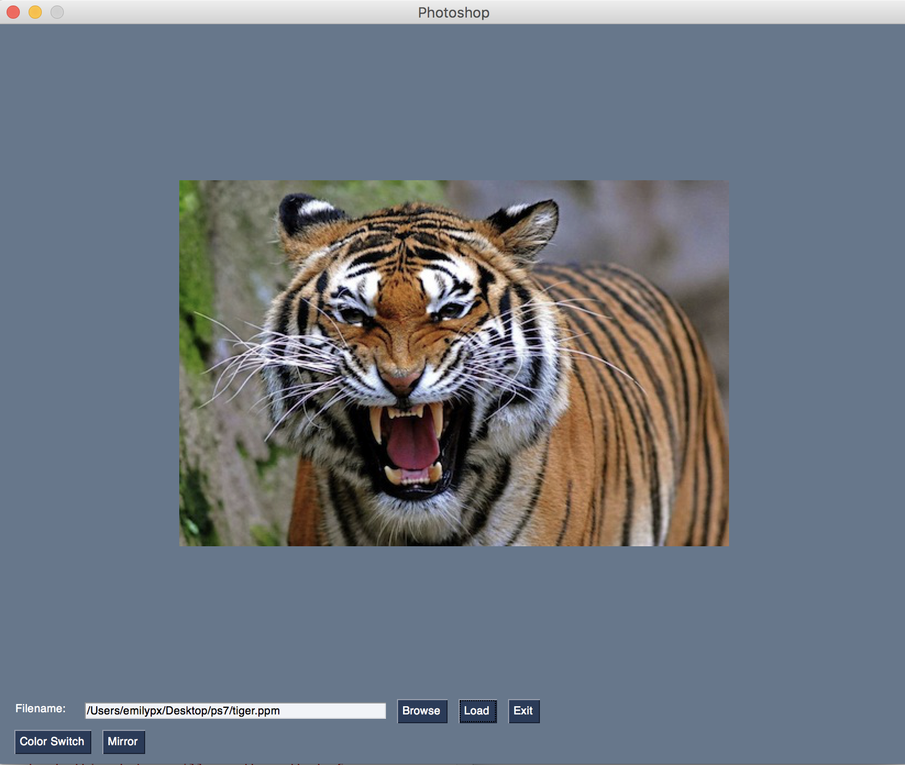

# Problem Set 7

### Due Tuesday, March 30, 2021, at 11:59pm EST

For this problem set, you will submit to Canvas **a single .zip file**. Detailed instructions for what the .zip file should contain are at the end of this problem set. Note that if you do not submit the files as specified here, there will be a major deduction in your grade for this assignment. Following directions to the letter is a crucial skill for computer programming.

As in Problem Set 7, I will give you starter code and you will just have to write a few functions, as described below.

**Comments:** Two points will be deducted if you provide no or minimal comments, and 1 point will be deducted if you have sufficient comments but they do not conform to the requirements previously outlined.

**Honor pledge**: And, as always, in every program, the first four lines (comments) should be your honor pledge.

---
## Step 1: Install the libraries
You are going to do something you have not done before for this class: install new Python libraries! I will ask you to try this *in class on Thursday* in case you run into problems. I will be available to assist you during office hours. It is crucial that you do this before you start the rest of the program. Here's how it should work.

### Mac

1. On a Mac, go to the magnifying glass in the upper right corner and type `Terminal`. Then launch the Terminal app that it finds for you.
2. A boring plain text window will open. At the prompt, type:

```
pip3 install PySimpleGUI
```

3. If all goes well, you will see output like this. It's okay if you also see a `WARNING` about needing to update `pip`! As long as you don' see `ERROR`, it worked.



4. Launch IDLE. At the prompt in IDLE type:

```
import PySimpleGUI
```

5. If you get no ouput at all, you are good to go! If you get `ModuleNotFoundError: No module named PySimpleGUI`, check to make sure that you didn't type something incorrectly. You can even just copy and paste what I have above to be sure. If you still get an error, see me.

### Windows

1. On a Windows 10 machine, go to the `Start` menu and look for `Command` or search on your computer for `Command`, and launch it.

2. A boring plain text window will open. At the prompt, type:

```
pip install PySimpleGUI
```

3. This probably won't work, so you can also try one of these commands:

```
pip3 install PySimpleGUI
```

or

```
py -3 -m pip install PySimpleGUI
```

4. Those might not work either. If you get anything that says `ERROR` or `Command not found` or similar, the problem is probably that you did not follow instructions to tick the box about adding Python to your PATH when you installed it back in January. [Follow these instructions to either reinstall Python or to manually add Python your PATH](https://datatofish.com/add-python-to-windows-path/)

5. Quit  `Command` and reopen it, and try typing one of the three commands above.

6. If all goes well, you will see output that says something like `Successfully installed!`. It's okay if you also see `WARNING`s! As long as you don't see `ERROR` or `Command not found`, it probably worked.

7. Launch IDLE. At the prompt in IDLE type:

```
import PySimpleGUI
```

8. If you get no ouput at all, you are good to go! If you get `ModuleNotFoundError: No module named PySimpleGUI`, check to make sure that you didn't type something incorrectly. You can even just copy and paste what I have above to be sure. If you still get an error, see me.


## Step 2: Get the files
**Download this folder to your computer!** All the work you will do will be in the downloaded version of this folder. When you're done, you will zip up the folder you downloaded and submit it on Canvas. As a reminder, to download a folder from GitHub, click on the green `Code` button, then select `Download Zip`.




## Step 3: Run the starter program
1. In IDLE, open the file in the directory you just downloaded called `DIY_photoshop.py`. 
2. Run the program. 
3. You should see a very primitive-looking graphical user iterface (GUI), like this. Where indicated in the picture below, click `Browse`, and then select one of the `ppm` image files in this directory. 



4. Here I've selected `tiger.ppm`. Click the `Load` button next to the `Browse` button. The GUI should now look like this:



5. Now click one of the two buttons in the lower left corner. Here I've selected `Mirror`. It creates a mirror image of the original photo! Click it again, and it will return to the original image.

6. Try the `Color Switch` button. You'll see that each time you click it, it changes the colors of the image. After three clicks, you get back to the original image.

## Step 4: Write the greyscale function

## Step 5: Write the black and white function

## Step 6: Write the pixellate function


---

## What to turn in
You have 
**Don't forget your comments!**

### This problem set is due Friday, March 19, 2021, at 11:59pm EST
